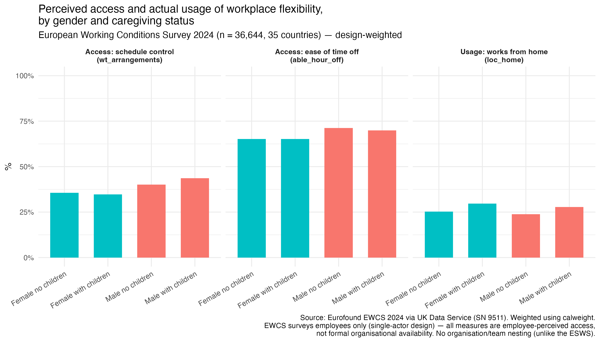

# EWCS 2024: workplace flexibility by gender and presence of children

**Data:** European Working Conditions Survey 2024, UKDS study 9511 (`ewcs24_dataset_ukda_v2.sav`).

n = 36,644, fieldwork 2024, 35 countries (EU27 + EFTA + Western Balkans), face-to-face fieldwork.

EWCS does not directly observe formal organisational provision of flexible working arrangements. 
The relevant measures used here are based on employees' own reports, so they capture perceived access or control rather 
than an independently observed organisational offer.

## Variables used

| Construct | Variable | Question | Coding used |
|---|---|---|---|
| Schedule control | `wt_arrangements` | "How are your working time arrangements set?" | 1=employer-fixed, no change possible · 2=choose among fixed schedules · 3=adapt within limits (flexitime) · 4=fully self-determined. "Has some control" = 3 or 4 |
| Ease of short-notice time off | `able_hour_off` | "How easy/difficult to arrange an hour or two off for personal/family matters?" | 1=very easy … 4=very difficult. "Easy" = 1 or 2 |
| Work-from-home use | `loc_home` | "How often have you worked from home in your main job?" | 1=always … 5=never. "Uses it at least sometimes" = 1, 2, or 3 |
| Gender | `sex2` | Binary sex categorisation | Male / Female (41 missing, non-binary not separately coded in this variable) |
| Children in household | `hh_nochilds` | Binary flag, household has no children under 15 | inverted to `has_children` |
| Weight | `calweight` | Final calibrated analysis weight | used throughout |

## Results

Design-weighted percentages using `calweight`.

| | Female, no children | Female, with children | Male, no children | Male, with children |
|---|---:|---:|---:|---:|
| **Schedule control** | 35.6% | 34.8% | 40.1% | 43.6% |
| **Ease of time off** | 65.2% | 65.1% | 71.2% | 69.9% |
| **Works from home** | 25.3% | 29.7% | 23.8% | 27.8% |

n: female/no children 11,878; female/with children 6,556; male/no children 12,071; male/with children 6,098. 
Forty-one respondents with missing gender are excluded.

## Interpretation

### Schedule control and ease of taking time off

Men report more schedule control than women in both household groups. 
The difference is about 5 percentage points among respondents without children and about 9 percentage points among those with children.

Men are also more likely than women to report that taking one or two hours off at short notice for personal or family matters is easy. 
The gender difference is around 5 to 6 percentage points in both household groups.

The presence of children does not substantially change either pattern for women. 
Among men, those with children report somewhat more schedule control than those without children, 
while ease of taking short-notice time off is slightly lower.

These are descriptive differences in employees' reported working conditions. 
The EWCS does not identify the organisational processes that generate them.

### Work-from-home use

The gender pattern is different for working from home.

Women report slightly higher work-from-home use than men in both household groups:

- no children: 25.3% among women and 23.8% among men
- with children: 29.7% among women and 27.8% among men

Having children is associated with greater work-from-home use for both women and men, by roughly 4 percentage points.

The important descriptive point is that the three flexibility indicators do not move in the same direction by gender. 
Women report less schedule control and less ease in taking short-notice time off, but somewhat more use of working from home.

This does not show that women have lower access to working from home specifically and then use that access more intensively. 
The EWCS variables used here measure different aspects of workplace flexibility, and there is no direct measure in this analysis of formal organisational access to working from home.

One possible interpretation is that different forms of flexibility operate differently across gender and family circumstances. 
For example, schedule autonomy and working from home may reflect different organisational practices or different employee needs. 
The present descriptive analysis cannot distinguish among these explanations.

## Presence of children

Respondents with children report more work-from-home use than respondents without children for both genders.

The same pattern is not visible for the two other flexibility indicators. Women with children report almost the same level of schedule control and ease of taking time off as women without children. 
Men with children report somewhat more schedule control than men without children, while their reported ease of taking time off is slightly lower.

Because `hh_nochilds` only indicates whether children under 15 are present in the household, it should not be interpreted as a direct measure of caregiving responsibility.

## Take-aways

- **Different dimensions of workplace flexibility show different gender patterns.** 
Women report lower schedule control and less ease in taking short-notice time off, but somewhat higher use of working from home.

- **Access-like measures and actual use should not be treated as interchangeable.** 
In this analysis, schedule control, ease of taking time off, and working-from-home use capture related but distinct aspects of workplace flexibility.

- **The presence of children is more clearly associated with work-from-home use than with the two access-related measures.** 
Work-from-home use is higher among respondents with children for both women and men.

- **EWCS measures the employee perspective.** 
It cannot directly distinguish formal organisational provision from employees' perceived access because it has no employer or HR informant.

- **A multi-actor, multilevel dataset could extend this analysis.** 
Combining employee reports with information from managers or organisations would make it possible to examine whether differences between formal provision, perceived access, 
and actual use are substantively meaningful.