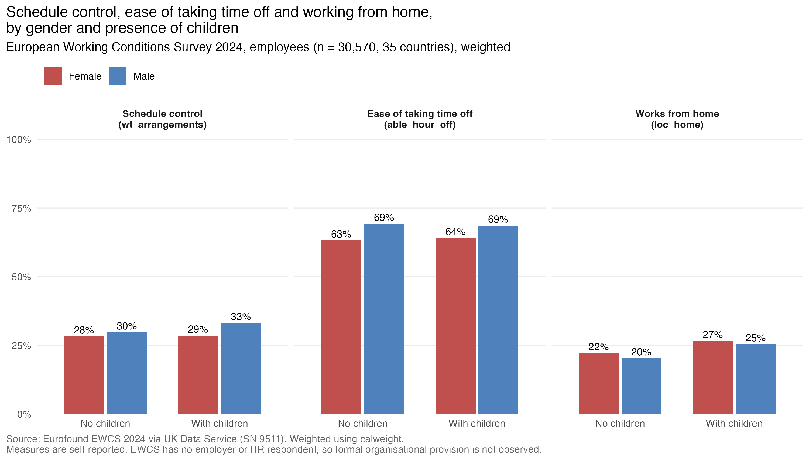

# EWCS 2024: workplace flexibility by gender and presence of children

**Data:** European Working Conditions Survey 2024, UKDS study 9511 (`ewcs24_dataset_ukda_v2.sav`).

n = 36,644 respondents, fieldwork 2024, 35 countries (EU27 + EFTA + Western Balkans), face-to-face fieldwork.

**Analytic sample:** employees only (`employee_selfdeclared == 1`), n = 30,570. 
Self-employed respondents are excluded because employer-provided flexibility does not apply to them.

## Variables used

| Construct | Variable | Question | Categories | Coding used |
|---|---|---|---|---|
| Schedule control | `wt_arrangements` (q44) | "How are your working time arrangements set?" | 1 = set by the organisation, no possibility for change · 2 = choose between several fixed schedules set by the organisation · 3 = adapt hours within certain limits (e.g. flexitime) · 4 = entirely determined by yourself | "Some control" = 3 or 4 vs. 1 or 2 |
| Perceived accessibility (ad hoc time off) | `able_hour_off` (q52) | "How easy or difficult is it for you to arrange to take an hour or two off during working hours to attend to personal or family matters?" | 1 = very easy · 2 = fairly easy · 3 = fairly difficult · 4 = very difficult | "Easy" = 1 or 2 |
| WFH usage (place flexibility) | `loc_home` (q29_d) | "How often have you worked in your own home in your main job?" | 1 = always · 2 = often · 3 = sometimes · 4 = rarely · 5 = never | "Uses WFH" = 1, 2 or 3 |
| Gender | `sex2` | Binary sex categorisation | Male / Female | 35 missing among employees; non-binary not separately coded in this variable |
| Children in household | `hh_nochilds` | Binary flag, household has no children under 15 | | inverted to `has_children` |
| Weight | `calweight` | Final calibrated analysis weight | | used throughout |

## Measurement notes

The three flexibility measures map only partly onto the access / usage distinction.

- **`wt_arrangements` measures schedule control rather than access.** 
It describes the working-time arrangement the respondent is actually in, so having the arrangement and using it cannot be separated. 
Category 2 (choosing between several fixed schedules set by the organisation) is grouped with category 1 as low schedule control.

- **`able_hour_off` is the closest item to perceived accessibility**, i.e. whether flexibility can be used in practice. 
It refers to occasional time off rather than a specific policy, and it also reflects workload and staffing, not only what the employer allows.

- **`loc_home` measures usage, but of place flexibility rather than time flexibility.** 
The other two items are about working time, so access and usage here do not refer to the same arrangement. 
EWCS 2024 has no item asking whether working from home is permitted, so access to WFH cannot be measured. 
"Never" (about 70% of employees) largely reflects jobs that cannot be done from home rather than a choice not to use an available option. 
The item may also capture unpaid work taken home, which is not a family-friendly arrangement.

### Why binary coding

Binary coding is used here because the purpose of this step is descriptive: it gives simple weighted percentages by gender and presence of children. 
It does lose information. The cut point for `wt_arrangements` is a substantive choice (see category 2 above), 
`able_hour_off` combines "fairly easy" with "very easy", and the `loc_home` cut differs from script 2, where "sometimes" is grouped with "rarely". 
A next step would be to check whether the results hold under other cut points.

### Missing values

Respondents who answered "don't know" or refused are counted in the "no" category of each indicator 
(81 employees on `wt_arrangements`, 512 on `able_hour_off`, 71 on `loc_home`). 
These are small shares of the sample and are not excluded in the current analysis; 
excluding them would be the cleaner choice in future analyses.

## Results

Design-weighted percentages using `calweight`, employees only.

| | Female, no children | Female, with children | Male, no children | Male, with children |
|---|---:|---:|---:|---:|
| **Schedule control** | 28.3% | 28.6% | 29.7% | 33.2% |
| **Ease of taking time off** | 63.2% | 64.1% | 69.3% | 68.6% |
| **Works from home** | 22.2% | 26.6% | 20.3% | 25.5% |

n: female/no children 10,197; female/with children 5,793; male/no children 9,584; male/with children 4,961. 
Thirty-five employees with missing gender are excluded.

## Interpretation

### Schedule control and ease of taking time off

Men report more schedule control than women in both household groups, but the gap is mainly among parents: 
about 1.5 percentage points among employees without children and about 4.5 percentage points among those with children.

Men are also more likely than women to report that taking an hour or two off for personal or family matters is easy. 
The gender difference is about 6 percentage points among employees without children and about 4.5 percentage points among those with children.

For women, the presence of children makes little difference to either measure. 
Among men, fathers report more schedule control than men without children (33.2% vs. 29.7%), while ease of taking time off is about the same.

These are descriptive differences in employees' reported working conditions. 
The EWCS does not identify the organisational processes that generate them.

### Working from home

The gender pattern is different for working from home. Women report slightly higher use than men in both household groups:

- no children: 22.2% among women and 20.3% among men
- with children: 26.6% among women and 25.5% among men

These gender differences are small (1 to 2 percentage points). 
Having children is associated with more working from home for both women and men, by about 4.5 to 5 percentage points.

So the three indicators do not move in the same direction by gender. 
Women report less schedule control and less ease in taking time off, but slightly more working from home.

This does not show that women have less access to working from home and then use it more intensively. 
The indicators measure different aspects of flexibility, and the EWCS has no measure of whether working from home is permitted. 
Schedule control and working from home may reflect different organisational practices or different employee needs; 
this descriptive analysis cannot distinguish between these explanations.

## Presence of children

Working from home is the indicator most clearly associated with the presence of children, for both women and men. 
The two time-flexibility measures differ little by household type, except that fathers report more schedule control than men without children.

Because `hh_nochilds` only indicates whether children under 15 live in the household, it should not be read as a direct measure of caregiving responsibility.

## Summary

- Women report lower schedule control and less ease in taking time off than men, but slightly more working from home. 
The schedule-control gap is mostly among parents.
- Having children goes together with more working from home for both women and men, but makes little difference to the two time-flexibility measures.
- The EWCS only has the employee's perspective. Without an employer or HR respondent, formal provision and perceived access cannot be told apart.
- Data that combine employee reports with information from managers or organisations would make it possible to compare formal provision, 
perceived access and actual use directly.