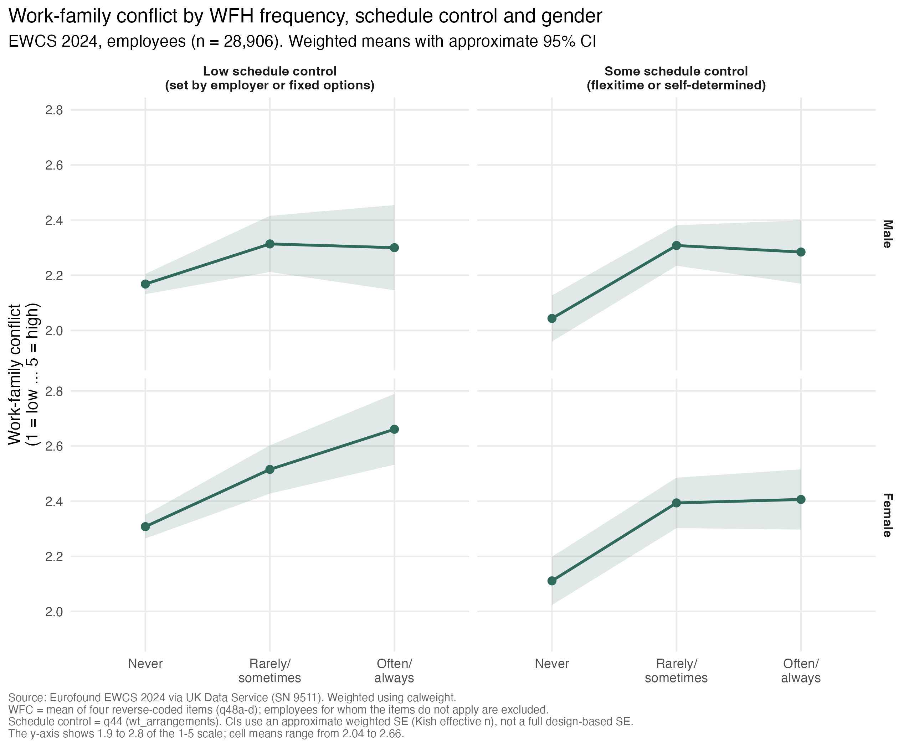

# Work-family conflict by working-from-home frequency, schedule control, and gender

The previous analysis showed that different dimensions of workplace flexibility do not follow the same gender pattern. 
Women reported less schedule control and less ease in taking time off than men, but slightly more working from home.

This analysis looks more closely at working from home and asks whether reported work-family conflict varies across 
combinations of working-from-home frequency, schedule control, and gender.

The analysis is restricted to employees (`employee_selfdeclared == 1`), as in analysis 01.

Among employees who work from home at least sometimes, women are more likely than men to have low schedule control: 
41.1% of female WFH users versus 31.9% of male WFH users (weighted).

## Method

This is a descriptive analysis. No interaction model is fitted at this stage.

Work-family conflict (WFC) is the mean of four reverse-coded items (q48a-d):

- `wlb_worry`
- `wlb_tired`
- `wlb_timefamily`
- `wlb_concentrate`

The resulting scale ranges from 1 to 5, with higher values indicating greater work-family conflict.

Respondents coded `-991` ("does not apply / no family responsibilities") on any of the four items are excluded from the
composite rather than treated as "never", because this response indicates that the question does not apply rather than an absence of conflict.

Cronbach's alpha for the four-item scale is 0.74.

N = 29,063 employees have complete data on all four items, and 28,906 also have valid data on schedule control, working-from-home frequency and gender.

Schedule control is based on `wt_arrangements` (q44) and is collapsed into two groups:

- low schedule control: working time is set by the organisation, or chosen from several fixed schedules set by the organisation (categories 1 and 2)
- some schedule control: working hours can be adapted within certain limits, e.g. flexitime, or are entirely self-determined (categories 3 and 4)

Working-from-home frequency (`loc_home`, q29_d) is collapsed from five categories into three:

- Never
- Rarely/sometimes
- Often/always

Means are weighted using `calweight`.

The confidence intervals use an approximate weighted standard error based on the Kish effective sample size. 
They are not full design-based confidence intervals because PSU and strata information are not used here.

## Results

Weighted mean work-family conflict, on a 1 to 5 scale, with approximate 95% confidence intervals:

| | Never | Rarely/sometimes | Often/always |
|---|---:|---:|---:|
| Male, low schedule control | 2.17 [2.13, 2.20] | 2.31 [2.21, 2.42] | 2.30 [2.15, 2.45] |
| Male, some schedule control | 2.04 [1.96, 2.13] | 2.31 [2.23, 2.38] | 2.28 [2.17, 2.40] |
| Female, low schedule control | 2.31 [2.26, 2.35] | 2.52 [2.43, 2.60] | 2.66 [2.53, 2.79] |
| Female, some schedule control | 2.11 [2.02, 2.20] | 2.39 [2.30, 2.49] | 2.41 [2.30, 2.52] |

## Interpretation

In all four gender-by-schedule-control groups, employees who work from home at least rarely report more work-family conflict than those who never do.

Three of the four groups then show a similar pattern: mean work-family conflict changes little between "rarely/sometimes" and "often/always" 
working from home.

Women with low schedule control show a different pattern. Their mean work-family conflict keeps rising across 
all three working-from-home categories, from 2.31 (never) to 2.52 (rarely/sometimes) and 2.66 (often/always).

As a result, the difference between low and some schedule control is largest among women who work from home often or always 
(2.66 vs. 2.41). Among men in the same working-from-home category, the two schedule-control groups report almost the same level of conflict (2.30 vs. 2.28).

Among employees who never work from home, those with low schedule control report more conflict than those with some control, for both women (2.31 vs. 2.11) and men (2.17 vs. 2.04).

This pattern suggests that the association between working from home and work-family conflict may vary jointly by schedule control 
and gender. In particular, frequent working from home is associated with relatively high reported conflict among women with low schedule control.

The result should not be interpreted as evidence that working from home without schedule control causes greater work-family conflict. 
Working-from-home frequency is not randomly assigned, and employees with greater family demands or existing work-family conflict may be more likely to work from home.

The composition of WFH users also differs by gender. Among employees who work from home, women are more often in the low-schedule-control group than men. 
This is descriptively relevant, but it does not establish why women are more likely to be in this combination of working conditions.

The differences in this analysis are modest in absolute size, and confidence intervals overlap across several adjacent groups. 
The purpose of this step is therefore to identify a descriptive pattern that can be examined more formally, 
rather than to establish a statistically tested interaction.

Analysis 03 tests the WFH frequency × schedule control × gender interaction in a multilevel model.
