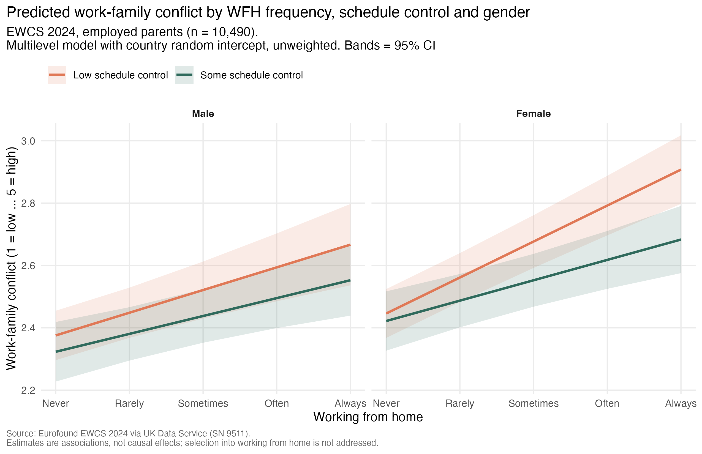
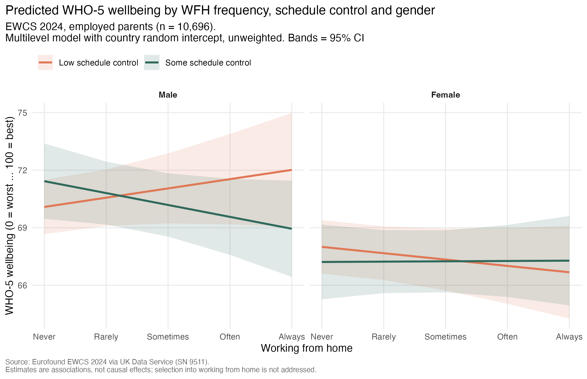

# Multilevel models of working from home, schedule control, gender, and work-family outcomes

This analysis follows the descriptive patterns examined in Analysis 02 and tests whether the association between working-from-home frequency and work-family outcomes varies by schedule control and gender.

Two outcomes are considered:

- work-family conflict
- WHO-5 wellbeing

The models account for clustering of respondents within countries through a random intercept for country. They are exploratory association models and are not intended to estimate causal effects.

## Sample

The analysis is restricted to employees (`employee_selfdeclared == 1`) with children under 15 in the household. 
It includes 10,701 employed parents with complete data on schedule control, working-from-home frequency, gender, and country:

- 4,935 men
- 5,766 women
- 35 countries

Of these respondents:

- 10,490 have complete data on the work-family conflict composite
- 10,696 have WHO-5 wellbeing data

## Model

The same specification is estimated for both outcomes:

`outcome ~ wfh_freq_c * schedule_control * gender + (1 | country)`

where:

- `wfh_freq_c` measures working-from-home frequency from 0 (never) to 4 (always)
- `schedule_control` distinguishes low schedule control from some schedule control
- `gender` distinguishes men and women
- the reference group is men with low schedule control
- country is included as a random intercept

Schedule control is based on `wt_arrangements` (q44). Low schedule control covers employees whose working time is set by the organisation, 
or chosen from several fixed schedules set by the organisation. Some schedule control covers employees who can adapt their working hours within certain limits 
(e.g. flexitime) or whose hours are entirely self-determined.

The models are unweighted. p-values use a normal approximation to the t statistic, as `lme4` does not report degrees of freedom.

To interpret the interactions, the script also reports the simple slope of WFH frequency in each gender-by-schedule-control group, 
and contrasts between these slopes.

These estimates describe associations rather than causal effects. Working-from-home frequency may itself be related to family demands, occupation, seniority, job characteristics, or existing work-family difficulties. These sources of selection are not addressed by the present specification.

## Results: work-family conflict

Work-family conflict ranges from 1 (low conflict) to 5 (high conflict).

| Term | Estimate | t | approx. p |
|---|---:|---:|---:|
| WFH frequency, men with low schedule control | +0.073 | 4.97 | <.001 |
| Some schedule control, men who never WFH | -0.052 | -1.54 | .12 |
| Female, low schedule control and never WFH | +0.070 | 3.72 | <.001 |
| WFH × schedule control | -0.015 | -0.73 | .47 |
| WFH × Female | +0.043 | 2.31 | .021 |
| Schedule control × Female | +0.028 | 0.61 | .54 |
| **WFH × schedule control × Female** | **-0.035** | **-1.24** | **.21** |

Simple slopes of WFH frequency (change in conflict per one-category increase in WFH frequency):

| Group | Slope | SE | approx. p |
|---|---:|---:|---:|
| Men, low schedule control | +0.073 | 0.015 | <.001 |
| Men, some schedule control | +0.057 | 0.015 | <.001 |
| Women, low schedule control | +0.115 | 0.011 | <.001 |
| Women, some schedule control | +0.065 | 0.014 | <.001 |

More frequent working from home is associated with higher work-family conflict in all four groups.

The slope is steepest for women with low schedule control (+0.115). 
It is steeper than for men with low schedule control (difference +0.043, p = .021) and steeper than for women with some schedule control (difference +0.050, p = .006). 
Among men, the slope hardly differs by schedule control (difference +0.015, p = .47), 
and among employees with some schedule control, it hardly differs by gender (difference +0.008, p = .71).

This is consistent with the descriptive pattern in Analysis 02, where work-family conflict rose most steadily with WFH frequency among women with low schedule control.

The three-way interaction itself is not statistically significant (p = .21). 
The model therefore does not provide strong evidence that the gender difference in the WFH-conflict slope differs between the two schedule-control groups, 
even though the slope contrasts point in that direction.

## Results: WHO-5 wellbeing

WHO-5 wellbeing ranges from 0 (lowest wellbeing) to 100 (highest wellbeing).

| Term | Estimate | t | approx. p |
|---|---:|---:|---:|
| WFH frequency, men with low schedule control | +0.48 | 1.31 | .19 |
| Some schedule control, men who never WFH | +1.34 | 1.57 | .12 |
| Female, low schedule control and never WFH | -2.08 | -4.38 | <.001 |
| WFH × schedule control | -1.10 | -2.06 | .039 |
| WFH × Female | -0.81 | -1.75 | .080 |
| Schedule control × Female | -2.13 | -1.81 | .070 |
| **WFH × schedule control × Female** | **+1.45** | **2.06** | **.039** |

Simple slopes of WFH frequency (change in wellbeing per one-category increase in WFH frequency):

| Group | Slope | SE | approx. p |
|---|---:|---:|---:|
| Men, low schedule control | +0.48 | 0.37 | .19 |
| Men, some schedule control | -0.62 | 0.39 | .11 |
| Women, low schedule control | -0.33 | 0.29 | .25 |
| Women, some schedule control | +0.02 | 0.36 | .96 |

Women report lower wellbeing than men. Among employees with low schedule control who never work from home, the difference is about 2 points on the 0-100 scale.

None of the four WFH slopes differs significantly from zero. 
The three-way interaction is statistically significant at the 5% level (p = .039), 
but it mainly reflects a difference among men: the WFH slope is slightly positive for men with low schedule control and slightly negative for men with some schedule control 
(difference -1.10, p = .039). Among women, the slopes for the two schedule-control groups do not differ (difference +0.35, p = .45).

Taken together, the wellbeing model does not show a clear association between WFH frequency and wellbeing in any group. 
The significant three-way interaction should be read cautiously: it rests on small slopes that are individually indistinguishable from zero, 
comes from one exploratory specification, and is not adjusted for multiple testing across the two outcome models.

## Comparing the two outcomes

The two outcomes do not show the same pattern.

For work-family conflict, more frequent working from home is consistently associated with higher conflict, 
and most strongly among women with low schedule control. The three-way interaction is not significant, 
but the slope contrasts support the descriptive pattern from Analysis 02.

For wellbeing, WFH frequency shows no clear association in any group, and the significant three-way interaction is driven by small, 
opposite-signed slopes among men.

This suggests that work-family conflict and general wellbeing should not be treated as interchangeable outcomes. 
The present analysis does not identify the mechanisms behind the different patterns.

## Predicted-values plots

The work-family conflict plot shows rising predicted conflict in all four groups, with the steepest increase among women with low schedule control.

The wellbeing plot shows wide, overlapping confidence bands, consistent with the absence of clear WFH slopes in any group.

## Summary

- Among employed parents, more frequent working from home is associated with higher work-family conflict for both women and men, 
regardless of schedule control.

- The association is strongest for women with low schedule control. Their slope is steeper than that of men with low schedule control 
and of women with some schedule control, although the formal three-way interaction is not significant.

- For wellbeing, there is no clear association with WFH frequency in any group. The significant three-way interaction rests on small slopes among men 
and should be interpreted with caution.

- The work-family conflict and wellbeing models therefore show different patterns rather than two versions of the same result.

- These are exploratory associations. Selection into working from home is not addressed and the models are unweighted. 
Stronger interpretation would require additional controls (e.g. occupation, working hours) and robustness checks.

## Files

- `R/03_multilevel_model.R`: model estimation, simple slopes, and predicted values
- `Output/03_multilevel_model_summaries.txt`: full model summaries, simple slopes and contrasts
- `Output/03_predicted_wfc_by_wfh_sc_gender.png`: predicted work-family conflict
- `Output/03_predicted_wellbeing_by_wfh_sc_gender.png`: predicted WHO-5 wellbeing
